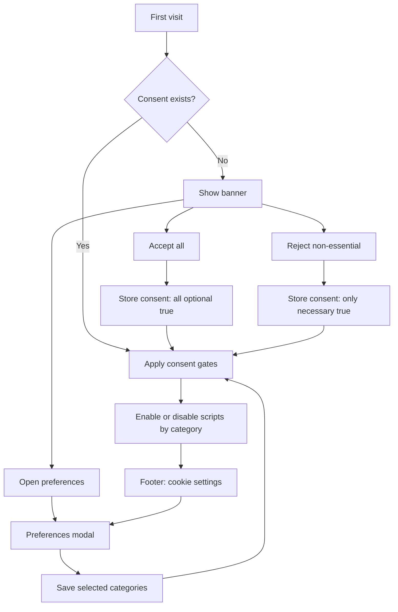

# Cookie consent flow (PL)

```mermaid
flowchart TD
    A[First visit] --> B{Consent exists?}
    B -- No --> C[Show banner]
    B -- Yes --> D[Apply consent gates]

    C --> E[Accept all]
    C --> F[Reject non-essential]
    C --> G[Open preferences]

    E --> H[Store consent: all optional true]
    F --> I[Store consent: only necessary true]
    G --> J[Preferences modal]

    J --> K[Save selected categories]
    H --> D
    I --> D
    K --> D

    D --> L[Enable or disable scripts by category]
    L --> M[Footer: cookie settings]
    M --> J
```
