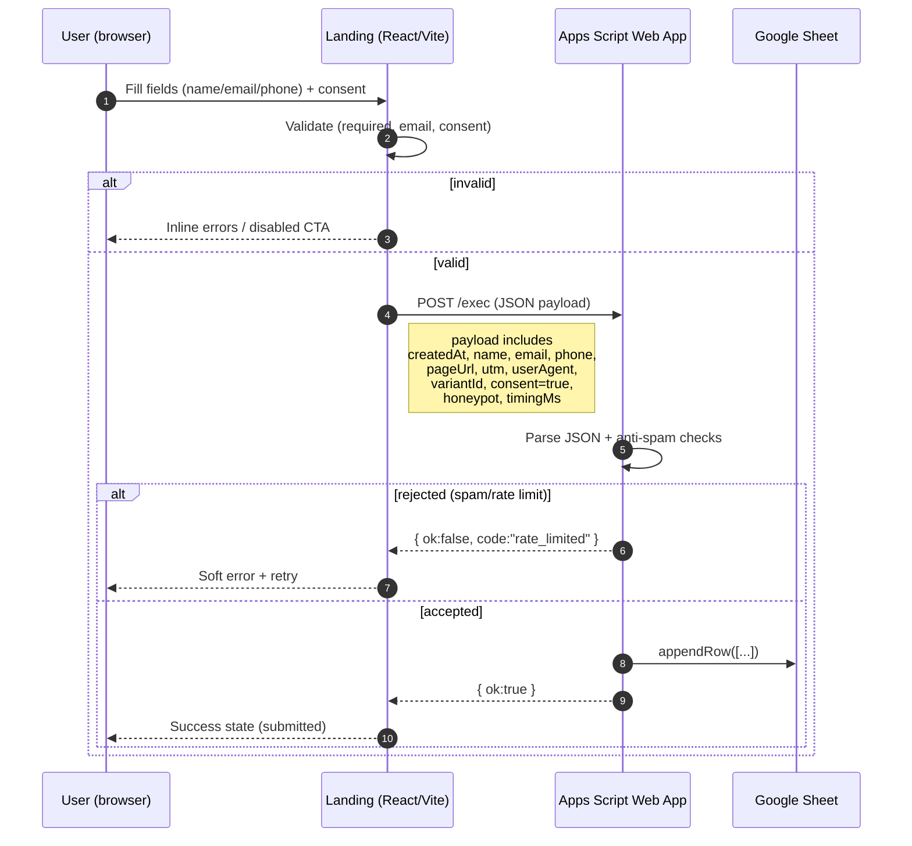

## Lead capture → Google Sheets (Apps Script)

```mermaid
sequenceDiagram
  autonumber
  participant U as User (browser)
  participant LP as Landing (React/Vite)
  participant AS as Apps Script Web App
  participant GS as Google Sheet

  U->>LP: Fill fields (name/email/phone) + consent
  LP->>LP: Validate (required, email, consent)
  alt invalid
    LP-->>U: Inline errors / disabled CTA
  else valid
    LP->>AS: POST /exec (JSON payload)
    note right of LP: payload includes<br/>createdAt, name, email, phone,<br/>pageUrl, utm, userAgent,<br/>variantId, consent=true,<br/>honeypot, timingMs
    AS->>AS: Parse JSON + anti-spam checks
    alt rejected (spam/rate limit)
      AS-->>LP: { ok:false, code:"rate_limited" }
      LP-->>U: Soft error + retry
    else accepted
      AS->>GS: appendRow([...])
      AS-->>LP: { ok:true }
      LP-->>U: Success state (submitted)
    end
  end
```

