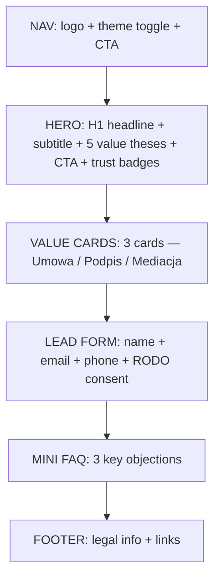

# Short Variant — Content Flow

## Page structure

## Sections kept vs removed (compared to App.jsx)

| Section | App.jsx | text_updates.jsx | short_variant |
|---|---|---|---|
| NAV | full variant tabs | full variant tabs | simplified |
| BG mesh | yes | yes | yes |
| Hero | H1 + structure image + list | H1 + blockquote + image | H1 + 5 theses (no image) |
| Pain block | yes (3 bento cards) | yes (3 bento cards) | **removed** |
| Three pillars / How it works | 3 pillars | 3 steps + 4 details | **reworked → 3 value cards** |
| Lead form | full | full | full (same logic) |
| Comparison table | yes | yes | **removed** |
| Social proof | hidden | hidden | **removed** |
| FAQ | none | 4 questions | **3 questions** |
| Final CTA | yes | yes | **removed** (form is the CTA) |
| Footer | yes | yes | yes |

## Content decisions
- Hero carries the full value proposition — no need to scroll to understand the service.
- Value cards compress "what you buy" into 3 digestible promises.
- Form appears early (3rd scroll) to minimize drop-off.
- Mini FAQ handles top 3 objections only.
