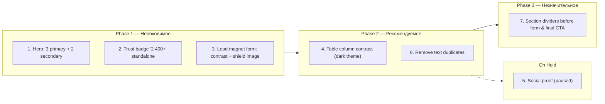

# UI/UX Conversion Improvements — Implementation Plan

## Overview

Based on GPT design review and owner feedback, this plan covers 6 active improvements
(task 5 paused) aimed at reducing cognitive load, boosting trust signals, and
increasing lead-capture form visibility.



---

## Phase 1 — Необходимое

### 1. Hero block: 3 primary + 2 secondary benefits

**Goal:** Reduce first-screen cognitive load from 5 equal items to 3 prominent + 2 light.

**Primary items** (larger font, full opacity, T.textPrimary):
- "Weryfikacja i podpis elektroniczny" (index 1)
- "Ubezpieczenie" (index 4)
- "Okazjonalny najem" (index 5)

**Secondary items** (smaller font, muted color, grouped under a label):
- "Mediacja" (index 2)
- "Wsparcie prawne" (index 3)

**Implementation:**
- Add `primary: true` flag to items at indices 1, 4, 5 in `heroStructureDescriptions.js`.
- In `App.jsx` Hero section, split rendering into two loops:
  1. Primary items: `fontSize: 18`, `strong` title, `T.textPrimary` color.
  2. Secondary items: rendered after a small label "Dodatkowe zabezpieczenia",
     `fontSize: 14`, `T.textSecondary` color, no bottom margin inflation.
- Keep numbering sequential (1–5) for consistency with the structure diagram.

**Files:** `src/content/heroStructureDescriptions.js`, `src/App.jsx` (Hero section ~L222-L255).

**Pitfalls:** None — structure diagram images already show all 6 levels
and don't depend on JS rendering order.

---

### 2. Trust badge "2 400+" as standalone micro-block

**Goal:** Make the #1 trust trigger visually dominant instead of competing
with compliance badges.

**Implementation:**
- Extract "2 400+ chronionych najemców" from the badges array.
- Render it as a standalone row directly below the CTA buttons:
  - Layout: `flex row`, centered, `gap: 10`.
  - Number `"2 400+"` in large `fontSize: 22`, `fontWeight: 800`, `color: T.cta`.
  - Label `"chronionych najemców"` in `fontSize: 15`, `color: T.textSecondary`.
  - Users icon to the left, slightly larger (`size: 20`).
  - Subtle background pill: `T.ctaDim` with `border: 1px solid T.ctaBorder`,
    `borderRadius: 99`, `padding: 8px 20px`.
- Move "eIDAS" and "RODO" badges into a smaller compliance strip below:
  - `fontSize: 12`, `color: T.badgesColor`, no background pill.
  - Gap reduced to 16px.

**Files:** `src/App.jsx` (Hero badges block ~L238-L254).

**Pitfalls:** On mobile the micro-block must wrap to column; add
`flex-direction: column` at `@media(max-width:500px)`.

---

### 3. Lead magnet form: higher contrast + shield image

**Goal:** Make the form card "pop" out of the dark background so users don't
mistake it for footer. Use shield_dark/light images as visual anchor.

**Theme changes (`src/theme.js`):**

| Token | DARK current | DARK new |
|---|---|---|
| `formCardBg` | `rgba(14,124,102,0.04)...` | `rgba(14,124,102,0.10), rgba(126,184,212,0.10)` |
| `formCardBorder` | `rgba(14,124,102,0.22)` | `rgba(14,124,102,0.45)` |
| `formCardShadow` | `...rgba(0,0,0,0.35)` | `0 0 80px rgba(14,124,102,0.12), 0 32px 80px rgba(0,0,0,0.35)` |

| Token | LIGHT current | LIGHT new |
|---|---|---|
| `formCardBg` | `rgba(14,124,102,0.06)...` | `rgba(14,124,102,0.09), rgba(21,54,136,0.06)` |
| `formCardBorder` | `rgba(14,124,102,0.3)` | `rgba(14,124,102,0.45)` |
| `formCardShadow` | `...rgba(21,54,136,0.1)` | `0 0 60px rgba(14,124,102,0.08), 0 32px 80px rgba(21,54,136,0.12)` |

**Shield image integration:**
- Import `shield_dark.png` and `shield_light.png` from `resources/`.
- On desktop (>850px): form section becomes `flex row` — shield image on the left
  (max-width ~200px, object-fit contain), form card on the right.
- On mobile: shield image shown above form card at smaller size (120px width)
  centered, or hidden entirely.
- Add media query: `.form-row { flex-direction: column; }` at max-width 850px.

**Files:** `src/theme.js`, `src/App.jsx` (Lead Capture section ~L370-L446).

**Pitfalls:**
- Images are in `resources/`, not `src/assets/`. Either move them to
  `src/assets/images/` for Vite bundling, or import from `resources/`
  (may need Vite alias / public folder).
  → **Recommendation:** copy to `src/assets/images/shield_dark.png` and
  `shield_light.png` for consistent Vite imports.
- Increasing formCardBg opacity may affect input field readability in light theme —
  test both themes after change.

---

## Phase 2 — Рекомендуемое

### 4. Table "Tradycyjny najem" column contrast (dark theme)

**Goal:** Ensure the "pain" column is readable enough for users to feel the contrast.

**Theme changes (`src/theme.js` DARK only):**

| Token | Current | New |
|---|---|---|
| `tableBadColor` | `rgba(255,255,255,0.55)` | `rgba(255,255,255,0.68)` |
| `tableBadIcon` | `rgba(255,255,255,0.45)` | `rgba(255,255,255,0.55)` |

This brings contrast ratio from ~5:1 to ~7:1 (WCAG AA compliant on the effective
background). Light theme values are fine as-is.

**Files:** `src/theme.js` (DARK object, lines 60-62).

**Pitfalls:** None — isolated token change.

---

### 5. Social proof → PAUSED

> **Status:** On hold — to be discussed separately. The SOCIAL PROOF section
> remains commented out in `App.jsx` until a decision is made.

---

### 6. Remove text duplicates

**Goal:** Eliminate redundancy that adds visual noise without new information.

**Duplicates found and fixes (FINALIZED):**

| # | Duplicate | Location | Fix |
|---|---|---|---|
| 6.1 | "Mediacja Rent Standard: decyzja w 14 dni" | Pain block facts list (4th item, `App.jsx` ~L312) | Replace with: `"68% sporów najmu dotyczy zwrotu kaucji"` (icon: `AlertTriangle`, color: `T.info`). New angle — deposit disputes — not mentioned elsewhere on page. Source: service_description.md risk "konflikty przy zwrocie depozitu". |
| 6.2 | Hero subtitle = heroStructureDescriptions[0].description verbatim | Hero `<p>` tag (`App.jsx` ~L219) | Replace with: `"Ochrona najmu od umowy po mediację — stworzona przez prawników."` — end-to-end positioning + trust keyword "prawników". SEO keywords preserved: "ochrona najmu", "prawników", "mediację". |
| 6.3 | "eIDAS" repeated in Hero list + Pillars card 2 + Table row 2 | Pillars card 2 features (`App.jsx` ~L340) | Change `"E-podpis eIDAS"` → `"Kwalifikowany e-podpis"`. Keep Hero and Table mentions unchanged (first/comparison context). |
| 6.4 | "Najem okazjonalny" repeated in Hero list + Pillars card 1 features | Pillars card 1 features (`App.jsx` ~L339) | Change `"Najem okazjonalny"` → `"Tryb okazjonalny (art. 692¹ KC)"`. Legal reference form signals expertise to 40–60 audience. |

**Files:** `src/App.jsx` (~L219, ~L312, ~L339, ~L340).

**Pitfalls:**
- 6.2: New subtitle still contains SEO keywords "ochrona najmu" and "prawników" — OK.
- 6.1: "68%" is a rounded market stat. Add footnote style if needed (italic, small font)
  to match existing pain block footnote pattern (~L303).

---

## Phase 3 — Незначительное

### 7. Gradient dividers between sections

**Goal:** Visually signal "new important block coming" before form and final CTA.

**Implementation:**
- Add a horizontal gradient line (same style as existing Final CTA divider:
  `width: 120px, height: 3px, background: linear-gradient(90deg, T.cta, T.info)`)
  before the Lead Capture section.
- Optionally add a subtle full-width divider (`height: 1px`,
  `background: linear-gradient(90deg, transparent, T.ctaBorder, transparent)`)
  before the Comparison Table section.

**Files:** `src/App.jsx` (before Lead Capture ~L370, before Comparison ~L448).

**Pitfalls:** Don't overdo it — max 2 dividers on the entire page.
The Final CTA already has one, so total = 3.

---

## Shield image usage summary

| Location | Usage | Theme-aware |
|---|---|---|
| Lead magnet form (primary) | Left-side visual anchor on desktop, top on mobile | `isDark ? shield_dark : shield_light` |
| Final CTA (optional, small) | Small decorative accent near heading | Same |

**File operations needed:**
1. Copy `resources/shield_dark.png` → `src/assets/images/shield_dark.png`
2. Copy `resources/shield_light.png` → `src/assets/images/shield_light.png`
3. Import in `App.jsx`:
   ```js
   import shieldDarkImg from "./assets/images/shield_dark.png";
   import shieldLightImg from "./assets/images/shield_light.png";
   ```

---

## Implementation order

```mermaid
gantt
  title Implementation Order
  dateFormat X
  axisFormat %s

  section Phase 1
  1. Hero 3+2 split           :a1, 0, 1
  2. Trust badge standalone    :a2, 0, 1
  3. Form contrast + shield    :a3, 1, 2

  section Phase 2
  4. Table contrast            :b1, 2, 3
  6. Text deduplication        :b3, 2, 3

  section Phase 3
  7. Section dividers          :c1, 4, 5
```



## Files affected

- `src/App.jsx` — tasks 1, 2, 3, 4, 6, 7
- `src/theme.js` — tasks 3, 4
- `src/content/heroStructureDescriptions.js` — task 1
- `src/assets/images/` — task 3 (copy shield_dark.png, shield_light.png from resources/)

## Post-implementation

- Visual check in both dark and light themes
- Mobile responsive check (≤850px, ≤500px breakpoints)
- Run Playwright smoke tests (`./automation/run-playwrite-tests.sh`)
