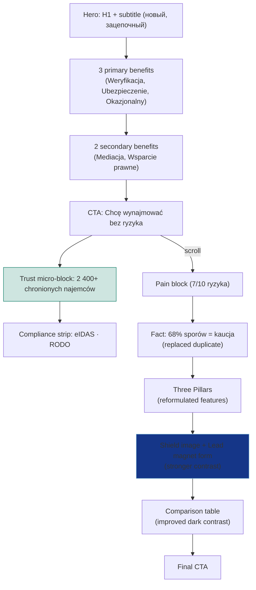
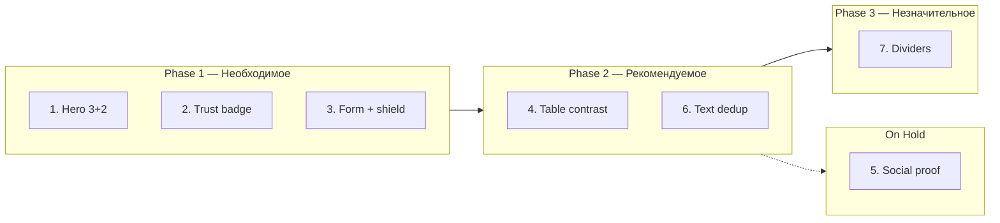

# UI/UX Conversion Optimizations — Final Overview

## Decision summary

| # | Task | Priority | Status | Decision |
|---|---|---|---|---|
| 1 | Hero: 3 primary + 2 secondary benefits | Необходимое | Ready | Primary: Weryfikacja, Ubezpieczenie, Okazjonalny najem. Secondary: Mediacja, Wsparcie prawne. |
| 2 | Trust badge "2 400+" standalone | Необходимое | Ready | Separate micro-block under CTA, compliance strip below. |
| 3 | Lead magnet form contrast + shield image | Необходимое | Ready | Stronger bg/border/shadow + shield_dark/light as visual anchor. |
| 4 | Table "Tradycyjny najem" contrast (dark) | Рекомендуемое | Ready | tableBadColor 0.55→0.68, tableBadIcon 0.45→0.55. |
| 5 | Social proof section | Рекомендуемое | **PAUSED** | To be discussed separately. |
| 6 | Text deduplication | Рекомендуемое | Ready | See details below. |
| 7 | Section dividers | Незначительное | Ready | Gradient dividers before form and before comparison table. |

## Task 6 — Text deduplication (finalized)

| # | What | Where | Change |
|---|---|---|---|
| 6.1 | Pain block duplicate "Mediacja 14 dni" | `App.jsx` pain facts, 4th item | → `"68% sporów najmu dotyczy zwrotu kaucji"` (icon: AlertTriangle, color: T.info) |
| 6.2 | Hero subtitle = heroStructureDescriptions[0] | `App.jsx` Hero `
` | → `"Ochrona najmu od umowy po mediację — stworzona przez prawników."` |
| 6.3 | "eIDAS" triple repeat | Pillars card 2 features | `"E-podpis eIDAS"` → `"Kwalifikowany e-podpis"` |
| 6.4 | "Najem okazjonalny" double | Pillars card 1 features | `"Najem okazjonalny"` → `"Tryb okazjonalny (art. 692¹ KC)"` |

## User flow with optimizations

## Implementation phases

## Files affected

- `src/App.jsx` — tasks 1, 2, 3, 4, 6, 7
- `src/theme.js` — tasks 3, 4
- `src/content/heroStructureDescriptions.js` — task 1
- `src/assets/images/` — task 3 (copy shield_dark.png, shield_light.png from resources/)
