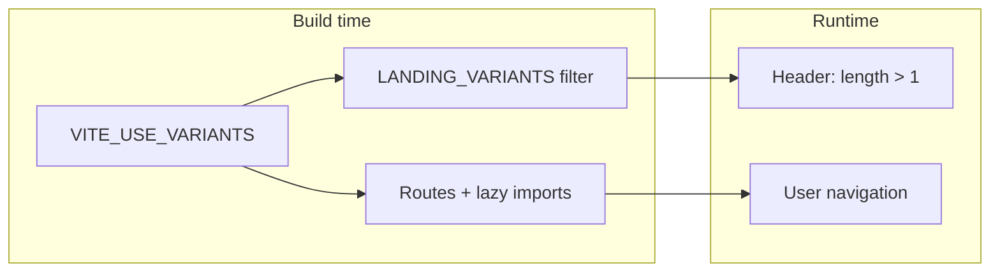

# Plan: `VITE_USE_VARIANTS` — header + production bundle

Toggle alternate landing variants via build-time env. When off: no variant links in the header and no alternate routes / chunks in the production build.

## Goals

- **Header:** Show links to other variants only when `VITE_USE_VARIANTS === 'true'`.
- **Production:** Do not ship alternate variant pages (routes + lazy chunks) when the flag is off.
- **CI:** GitHub Pages build uses default `false` (root `.env` and/or workflow `env`).

## Env

| Variable              | Default | Meaning                                      |
| --------------------- | ------- | -------------------------------------------- |
| `VITE_USE_VARIANTS`   | **`false`** | Only the string **`'true'`** enables variants; unset, `false`, or any other value → variants off. |

Vite only exposes `import.meta.env` keys prefixed with `VITE_` to the client.

**Implementation rule:** treat as enabled only with `import.meta.env.VITE_USE_VARIANTS === 'true'`. The committed **`.env`** sets `VITE_USE_VARIANTS=false` so dev server and builds match that default; use **`.env.local`** for `VITE_USE_VARIANTS=true` when testing variants locally.

## Flow

## Steps

1. **`src/landingVariants.js`**
   - Read `import.meta.env.VITE_USE_VARIANTS === 'true'`.
   - Export **`LANDING_VARIANTS`**: if false, only the default route (short variant at `/`, `variantId: "s1"`).
   - Optionally export **`SHOW_VARIANT_NAV`** = flag is true and `LANDING_VARIANTS.length > 1` (or keep a single condition `length > 1` if the list is always trimmed).

2. **`src/main.jsx`**
   - Remove top-level static imports of `text_updates.jsx` and `short_variant.jsx`.
   - Map `v1` / `s1` to **`React.lazy(() => import(...))`** (or equivalent) only in code paths reachable when `VITE_USE_VARIANTS === 'true'`, so dead-code elimination drops those chunks when the flag is false at build time.
   - Register routes from the same filtered `LANDING_VARIANTS`.

3. **Header (4 places)**
   - `App.jsx`, `versions/gpt_recommendations.jsx`, `versions/text_updates.jsx`, `versions/short_variant.jsx`: use **`SHOW_VARIANT_NAV`** or rely on shortened `LANDING_VARIANTS` + `length > 1` so the switcher disappears when variants are off.

4. **Themes (optional, second pass)**
   - `src/themes/index.js`: register `gpt_recommendations` only when `VITE_USE_VARIANTS === 'true'` to shave a tiny amount from the bundle; `getThemesForVariant` already falls back to main.

5. **`.github/workflows/deploy-pages.yml`**
   - Optional: set `VITE_USE_VARIANTS: 'false'` in the build step `env` for an explicit prod override; otherwise the checked-in `.env` already defaults to `false`.

6. **Docs / local dev**
   - Root `.env` documents the default; `README` or `.env.example` can mention `.env.local` with `VITE_USE_VARIANTS=true` for local variant testing.

7. **Verification**
   - Run `./automation/build.sh` with flag off; confirm `dist` has no unnecessary variant chunks.
   - Playwright smoke tests (root only) should stay green without changes.

## Files touched (expected)

- `src/landingVariants.js`
- `src/main.jsx`
- `src/App.jsx`, `src/versions/*.jsx` (header condition)
- `.github/workflows/deploy-pages.yml`
- `.env` (default `VITE_USE_VARIANTS=false`)
- Optional: `src/themes/index.js`, `README` / `.env.example`

## Out of scope

- Runtime toggling without rebuild (env is compile-time in Vite).
- Hiding variants from users who guess URLs unless routes are removed from the build (step 2 covers that).
